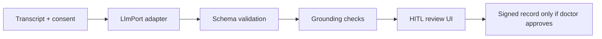

# AI Agent Training Roadmap — Patient Examination

- **Status:** Phase 6 guidance (post-platform engineering)
- **Last updated:** 2026-06-21
- **Goal:** Train and validate an AI clinical assistant that can **identify, structure, and support examination of every patient** — always under **human-in-the-loop (HITL)** control.

> The platform already enforces AI safety (consent, provenance, HITL, no auto-sign). This roadmap covers **model training, evaluation, and operational rollout** — not replacing clinicians.

---

## 1. Target capabilities

The AI agent should reliably:

1. **Identify the patient context** — single patient/session binding; no cross-patient leakage.
2. **Extract structured facts** from transcripts (symptoms, negatives, meds, allergies refs).
3. **Summarize** consultations with uncertainty visible.
4. **Suggest** missing questions, differentials, exams, and red flags — never auto-diagnose.
5. **Ground every output** in transcript segments with provenance.
6. **Support multilingual** workflows (EN / AR / FR, RTL for Arabic).

---

## 2. Training data strategy (synthetic-first)

| Stage | Data | Purpose |
|---|---|---|
| **A. Stub / rules** | Built-in stub adapter (current) | Dev, CI gates, UI integration |
| **B. Synthetic cases** | Expand `eval_dataset` with specialty scenarios | Regression + metric gates |
| **C. De-identified pilot** | Clinic-approved de-identified transcripts | Domain adaptation (with DPA) |
| **D. Human corrections** | Clinician edits from HITL workflow | Preference / RLHF-style fine-tuning |

**Never train on production PHI without explicit consent, de-identification, and legal approval.**

### Recommended synthetic case library (minimum 50 cases)

- Primary care: headache, chest pain, diabetes follow-up, pediatric fever
- Red-flag scenarios: thunderclap headache, STEMI symptoms, suicidal ideation (high sensitivity)
- Multilingual: parallel EN/AR/FR transcripts for the same case
- Edge cases: prompt injection in transcript, multi-speaker confusion, incomplete exams

---

## 3. Model & infrastructure path



| Step | Action |
|---|---|
| 1 | Keep **default self-hosted** path (`LLM_PROVIDER=local`); complete `LocalLlmAdapter` with your chosen clinical LLM |
| 2 | Define **prompt versions** in `prompt_version` table; pin active version per org |
| 3 | Run **`python -m app.scripts.run_ai_eval`** on every model/prompt change (CI gate) |
| 4 | Enable **`AI_USE_CELERY_EXTRACTION=true`** for async extraction at scale |
| 5 | Log all runs to `ai_extraction_run` + `ai_provenance` for audit |

---

## 4. Evaluation metrics (must pass before pilot)

| Metric | Gate | Tool |
|---|---|---|
| Schema validity | 100% | `run_stub_eval` / expanded eval harness |
| Grounding rate | ≥ 99% facts linked to segments | eval harness |
| Red-flag recall (synthetic) | 100% on red-flag cases | labeled eval set |
| Cross-patient leakage | 0 incidents | security + AI tests |
| HITL compliance | 0 auto-apply to signed notes | integration tests |
| Latency p95 | < 30s extraction (pilot SLA) | load tests |

Extend `backend/app/modules/ai/eval.py` with additional cases and persist results to `eval_run`.

---

## 5. Per-patient examination workflow (product)

For **every patient**, the clinician should:

1. Open patient profile → **Start consultation**
2. Capture **recording + AI consent**
3. Record / upload audio → **transcribe**
4. Run **AI extraction** → review facts, summary, suggestions
5. **Approve / edit / reject** each suggestion (audited)
6. **Sign clinical note** (doctor only)

Dashboard KPIs (`/dashboard`) track pending AI reviews and consultations in progress per org.

---

## 6. Training pipeline (recommended 12-week plan)

| Week | Focus | Deliverable |
|---|---|---|
| 1–2 | Expand synthetic eval dataset (50+ cases) | `eval_dataset` rows + CI gates |
| 3–4 | Wire self-hosted LLM (`LocalLlmAdapter`) | Staging inference endpoint |
| 5–6 | Prompt engineering + version pinning | Prompt v2 in governance |
| 7–8 | Clinician UAT on synthetic cases | Signed [clinical-validation-checklist.md](./clinical-validation-checklist.md) |
| 9–10 | Pilot de-identified fine-tuning (if approved) | Model artifact + eval report |
| 11 | Shadow mode (AI suggestions only, no pilot patients) | Metrics dashboard |
| 12 | Controlled pilot go-live | [pilot-deployment-guide.md](./pilot-deployment-guide.md) |

---

## 7. Commands & checkpoints

```bash
# Seed demo patients for dashboard / UAT
docker compose exec backend python -m app.scripts.seed_synthetic
docker compose exec backend python -m app.scripts.seed_demo_clinical

# AI eval gates (must pass)
docker compose exec backend python -m app.scripts.run_ai_eval

# Load smoke
python scripts/load_smoke.py --base-url http://localhost:8000 --auth-smoke
```

**Go/no-go for real patient AI processing:**

- [ ] DPIA + privacy notice signed off
- [ ] Clinical validation checklist complete
- [ ] Eval gates pass on target model + prompt version
- [ ] `AI_ALLOW_EXTERNAL_PHI=false` unless BAA in place
- [ ] Governance feature flags reviewed per org

---

## 8. What not to automate

Per [ai-safety-spec.md](./ai-safety-spec.md), the agent must **never**:

- Auto-sign notes or prescriptions
- Present AI output as confirmed diagnosis
- Skip HITL review
- Process without active AI consent

These are structural platform guarantees — training cannot override them.

---

## 9. Next immediate actions

1. Run `seed_demo_clinical` and verify the **professional dashboard** at `/en/dashboard`.
2. Expand eval dataset beyond `synthetic_headache_v1`.
3. Implement production body in `LocalLlmAdapter` pointing to your clinical LLM.
4. Schedule clinician UAT using the clinical validation checklist.
5. Execute controlled pilot per pilot deployment guide.
