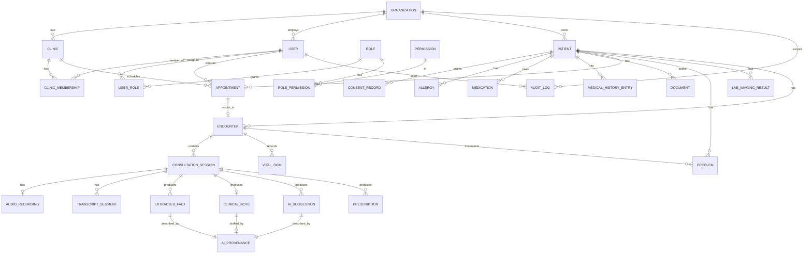

# Entity-Relationship Diagram — AI Examinator

- **Status:** Draft v1 (Phase 0)
- **Last updated:** 2026-06-20

Mermaid ERD of the core domain (Phases 1–4). Integration/reporting entities are described in prose at the end.
Every tenant-owned table also carries the cross-cutting columns listed in §"Common columns" (omitted from the
diagram for readability).

## Core ERD

## Entity highlights

### Foundation
- **ORGANIZATION** — top-level tenant. Root of isolation.
- **CLINIC** — a site within an organization.
- **USER** — a person with credentials; belongs to one organization.
- **CLINIC_MEMBERSHIP** — links users to clinics (ABAC scope).
- **ROLE / PERMISSION / USER_ROLE / ROLE_PERMISSION** — RBAC.
- **AUDIT_LOG** — append-only, hash-chained record of every PHI access and clinical/AI decision.

### Clinical records
- **PATIENT** — demographic + medical profile; org-scoped.
- **CONSENT_RECORD** — explicit recording + AI-processing consent, with scope, timestamp, method, and granting user.
- **ALLERGY**, **MEDICATION**, **MEDICAL_HISTORY_ENTRY**, **PROBLEM** (ICD-10), **VITAL_SIGN**, **LAB_IMAGING_RESULT** (LOINC/DICOM ref).
- **DOCUMENT** — attachment metadata; bytes stored in object storage; accessed via signed URLs.
- **APPOINTMENT** → **ENCOUNTER** → **CONSULTATION_SESSION**.

### Consultation
- **AUDIO_RECORDING** — encrypted object-storage reference, duration, status (supports interrupted-recording recovery).
- **TRANSCRIPT_SEGMENT** — speaker label, language, text, confidence, start/end offsets, edited flag.
- **CLINICAL_NOTE** — draft → signed lifecycle; `content_hash`, `signed_by`, `signed_at`; immutable once signed.
- **PRESCRIPTION** — document-only prescription (RxNorm refs), requires doctor confirmation.

### AI
- **EXTRACTED_FACT** — `fact_type` (chief_complaint, symptom, onset, severity, history, allergy, medication, vital,
  exam_finding, risk_factor, relevant_negative, red_flag), value, `source_segment_ref`, confidence, `status`.
- **AI_SUGGESTION** — `suggestion_type` (differential_diagnosis, missing_question, recommended_exam, next_step),
  concept, supporting_facts, missing_info, conflicting_info, confidence, red_flag_warnings, source_refs,
  `decision` (pending/approved/edited/rejected), decided_by, decided_at.
- **AI_PROVENANCE** — model_id, prompt_version, input_hash, parameters, generation_timestamp, provider, latency.

## Common columns (on every tenant-owned table)

| Column | Type | Notes |
|---|---|---|
| `id` | UUID (pk) | application-generated UUIDv7-style ordering |
| `organization_id` | UUID (fk) | tenant key; RLS predicate |
| `created_at` / `updated_at` | timestamptz | auto-managed |
| `created_by` / `updated_by` | UUID (fk user) | actor tracking |
| `deleted_at` | timestamptz null | soft delete |
| `data_classification` | enum | `public` / `internal` / `phi` / `sensitive_phi` |

## Status / lifecycle enums

- **ConsultationSession.status:** `created → consented → recording → transcribing → review → noted → signed → archived` (+ `interrupted`, `cancelled`).
- **ClinicalNote.status:** `draft → signed` (signed is terminal & immutable; amendments create a linked addendum).
- **AISuggestion.decision:** `pending → approved | edited | rejected`.
- **ExtractedFact.status:** `extracted → confirmed | corrected | rejected`.

## Integration/reporting entities (described, not yet modeled in detail)

- **FHIR_RESOURCE_MAP** — maps internal entities to FHIR R4 resource ids.
- **NOTIFICATION**, **REMINDER**.
- **EXPORT_JOB**, **ERASURE_REQUEST**, **RETENTION_POLICY**.
- **FEATURE_FLAG**, **PROMPT_VERSION**, **EVAL_DATASET**, **EVAL_RUN**.

Full column-level detail lives in [data-dictionary.md](./data-dictionary.md) and is finalized incrementally per phase
via Alembic migrations.
